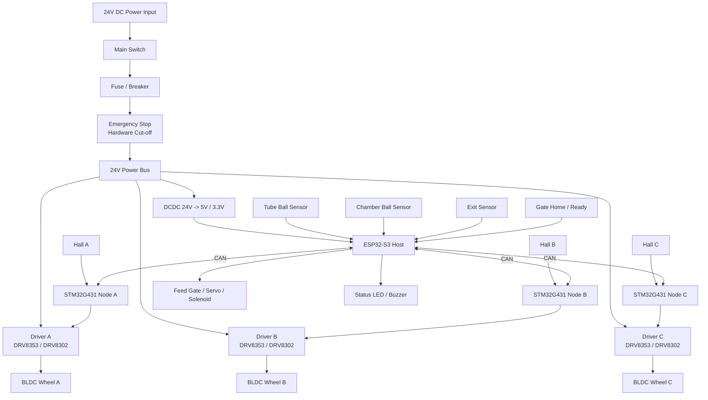
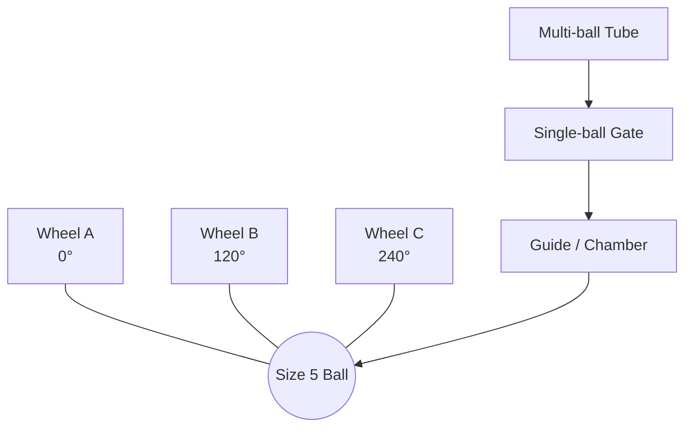

# 连接图

## 系统连接图（Mermaid）

```mermaid
flowchart TB
    PWR[24V DC Power Input] --> SW[Main Switch]
    SW --> FUSE[Fuse / Breaker]
    FUSE --> ESTOP[Emergency Stop\nHardware Cut-off]
    ESTOP --> BUS[24V Power Bus]

    BUS --> DCDC[DCDC 24V -> 5V / 3.3V]
    DCDC --> HOST[ESP32-S3 Host]

    BUS --> DRVA[Driver A\nDRV8353 / DRV8302]
    BUS --> DRVB[Driver B\nDRV8353 / DRV8302]
    BUS --> DRVC[Driver C\nDRV8353 / DRV8302]

    NODEA[STM32G431 Node A] --> DRVA
    NODEB[STM32G431 Node B] --> DRVB
    NODEC[STM32G431 Node C] --> DRVC

    DRVA --> MA[BLDC Wheel A]
    DRVB --> MB[BLDC Wheel B]
    DRVC --> MC[BLDC Wheel C]

    HALLA[Hall A] --> NODEA
    HALLB[Hall B] --> NODEB
    HALLC[Hall C] --> NODEC

    HOST <-->|CAN| NODEA
    HOST <-->|CAN| NODEB
    HOST <-->|CAN| NODEC

    TUBE[Tube Ball Sensor] --> HOST
    CHAMBER[Chamber Ball Sensor] --> HOST
    EXIT[Exit Sensor] --> HOST
    GATEFB[Gate Home / Ready] --> HOST

    HOST --> FEED[Feed Gate / Servo / Solenoid]
    HOST --> LED[Status LED / Buzzer]
```

## 120° 三轮机械关系图（示意）

```mermaid
flowchart TB
    BALL((Size 5 Ball))
    WA[Wheel A\n0°]
    WB[Wheel B\n120°]
    WC[Wheel C\n240°]

    WA --- BALL
    WB --- BALL
    WC --- BALL

    TUBE[Multi-ball Tube] --> GATE[Single-ball Gate]
    GATE --> GUIDE[Guide / Chamber]
    GUIDE --> BALL
```

## 接线说明
- Host 与三个电机节点通过 **CAN 总线**连接
- 急停通过 **硬件回路**切断驱动使能/主回路，不仅靠通信命令
- Hall 线、CAN 线、三相动力线分开走线
- 多球管道传感器统一接到 Host
- 单球分离机构由 Host 控制，传感器反馈闭环确认到位
